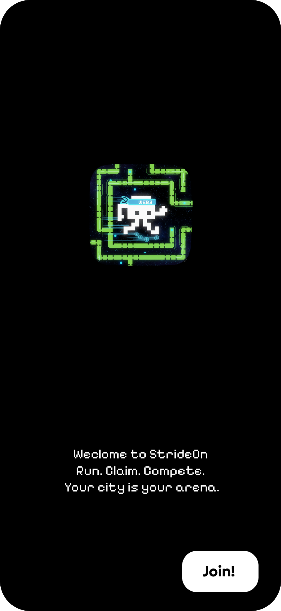
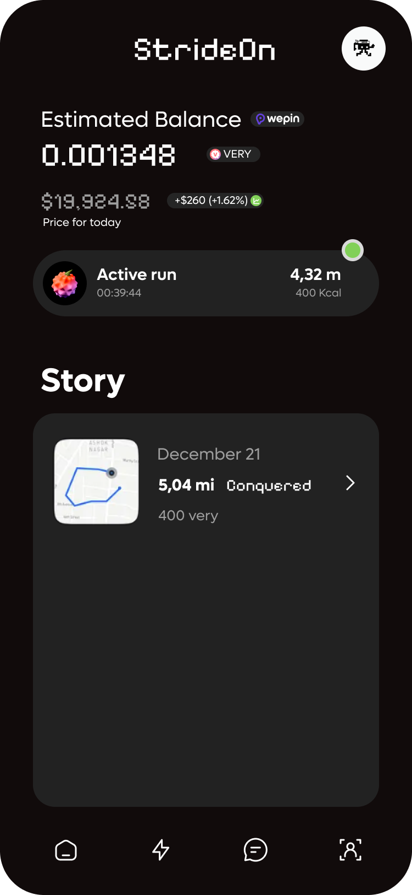
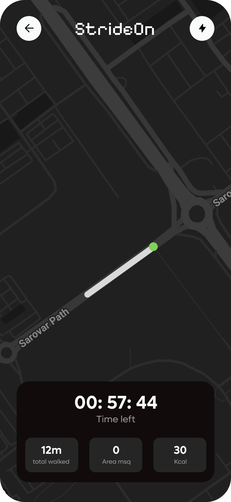
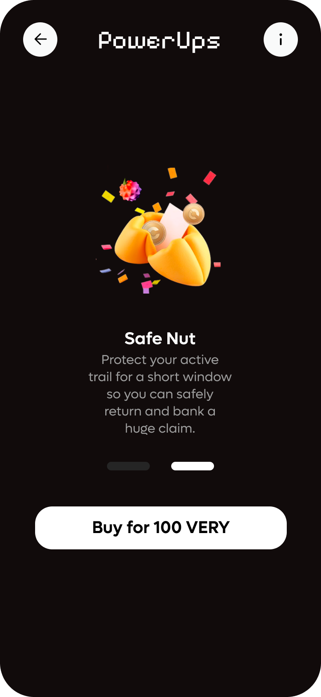
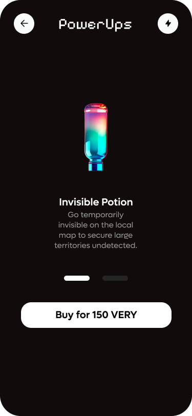
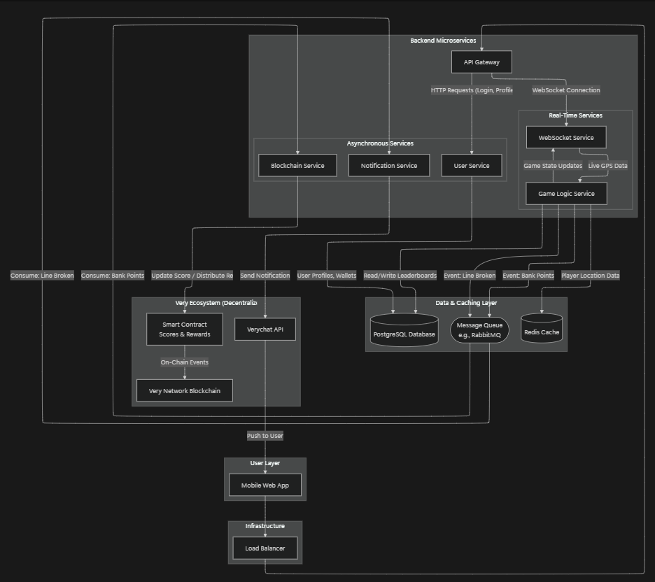
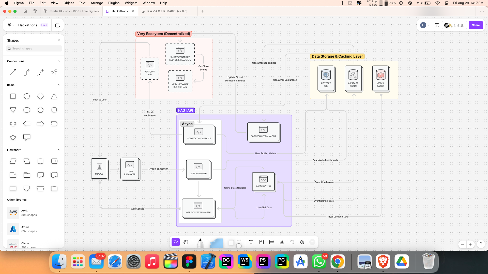

# StrideOn — The City Is Your Arena

<div align="center">


**The Competitive Move-to-Earn Game That Transforms Your City Into a Strategic Arena**

*Turn outdoor activity into strategic territory battles while earning VERY tokens*

📱 **[Android_App](https://github.com/chandan989/StrideOn/tree/main/StrideonApp)** | 🎥 **[Demo Video](https://www.youtube.com/watch?v=z3qVbHfGXVc)** | 🌐 **[Landing Page](https://strideon.vercel.app/)** | 📚 **[Documentation](https://www.notion.so/Complete-Technical-Architecture-Data-Flow-25eda6675e0c80228517e6003ed156c7)**

</div>

---

## 🎯 The Opportunity: Making Fitness Fun & Web3 Accessible

The world is full of fitness apps that become boring after a week and complex Web3 games that are disconnected from our real lives. **StrideOn** seizes this opportunity by fusing the two. We've created a "move-to-earn" game that is genuinely fun, deeply social, and serves as a seamless on-ramp to the Web3 world.

---

## 💡 Our Solution: A Real-World GPS Strategy Game

StrideOn is a game of risk, strategy, and speed, played on the streets of your own city using cutting-edge H3 hexagonal spatial indexing for precision territory control.

### Core Gameplay Loop

**🏃‍♂️ Create Your Trail:** Players create glowing GPS paths called "Trails" on a live map by walking or running. Every step is mapped to H3 hex cells, creating a precise digital representation of your real-world movement.

**⚔️ Strategic Territory Battles:** The game becomes thrilling through conflict. You can see active trails of rival players in your area. If you physically cross their path, you **"cut"** their trail and steal all their unclaimed progress. Alternatively, create strategic loops by returning to your existing territory to claim the enclosed hexagonal area.

**🏦 Bank Your Victory:** To secure your points, you must strategically reach real-world landmarks that serve as "banking checkpoints." Banking converts your claimed territory into permanent VERY tokens stored securely on the blockchain, making them safe from future attacks.

This creates a thrilling battle for territory where every street corner holds potential rivals and every route decision impacts your earnings.

---

## 📸 Screenshots Gallery

<div align="center">

| Welcome Screen | Login | Registration |
|:--------------:|:-----:|:------------:|
|  |  |  |
| *Onboarding experience with game introduction* | *Secure authentication system* | *Quick account creation process* |

| Home Dashboard | Live Map with H3 Grid | Power-ups Store |
|:-------------:|:--------:|:---------:|
|  |  |  |
| *Game status, stats, and navigation* | *Real-time hex grid overlay on city map* | *Strategic enhancement marketplace* |

| Power-ups Detail | System Architecture |
|:----------------:|:-------------------:|
|  |  |
| *Detailed power-up effects and costs* | *Complete technical system design* |

</div>

---

## 💬 Why the Very Network?

StrideOn isn't just built *on* the Very Network; it's built to showcase its power and grow its community through meaningful integration.

### 🏃‍♂️ Real-World Utility
We directly answer the hackathon's call by turning daily physical activity into a fun and rewarding experience. Unlike abstract DeFi protocols or purely digital NFT games, StrideOn creates tangible value from something everyone can do - moving through their city.

### ⚡️ Deep VeryChat Integration
Our backend sends real-time social notifications directly to **VeryChat**. When a rival cuts your trail, you get an instant alert in VeryChat, enabling immediate social reactions, friendly rivalries, and community building. Players form local teams in VeryChat groups to coordinate neighborhood domination strategies.

### 💰 Genuine VERY Token Utility
The **VERY token** powers our entire game economy:
- **Primary Rewards**: Players earn VERY tokens for successful territory claims and daily leaderboard rankings
- **Strategic Power-ups**: Spend tokens for competitive advantages like Shield protection or Ghost Mode invisibility
- **Staking System**: Lock VERY tokens for enhanced earning multipliers
- **Governance**: Token holders vote on new features, city expansions, and game parameter changes

---

## 🏗️ Technical Architecture: Speed Meets Security

<div align="center">

**[View Full Architecture on Figma](https://www.figma.com/board/TDvmb7NZhGjIIskTa9DAgy/StrideOn?node-id=0-1&t=XZz5CEsqnGmjazmq-1)**



</div>

### Hybrid Architecture Design

StrideOn uses a sophisticated hybrid architecture that leverages the best of both centralized and decentralized systems to deliver optimal performance and security.

**⚡ Speed-First Gaming Layer (Off-chain)**
- **Python FastAPI Backend**: Handles real-time GPS processing, trail collision detection, and live multiplayer interactions with sub-150ms response times
- **Redis Cache**: Maintains hot game state in memory for instant responses - active trails, player positions, and territorial claims
- **WebSocket Gateway**: Enables real-time communication between players for live competition and social features
- **H3 Spatial Engine**: Uses Uber's H3 hexagonal grid system for precise territory mapping and efficient collision detection

**🔒 Trust & Settlement Layer (On-chain)**
- **Signify Mainnet**: Production blockchain providing high performance with low costs for gaming transactions
- **Smart Contracts**: Handle secure banking of claimed territories and transparent reward distribution
- **Merkle Proof System**: Batch verification of game results for gas efficiency while maintaining security
- **VERY Token Integration**: Native token for all economic activities within the game

**🔄 Data Flow Process**
1. **GPS Tracking**: Mobile app streams location data to backend servers
2. **Real-time Processing**: Server maps GPS to H3 cells, detects trail collisions, and processes territory claims
3. **Live Updates**: WebSocket broadcasts keep all players synchronized with nearby activity
4. **Secure Banking**: When players choose to bank their progress, results are cryptographically verified and settled on-chain
5. **Reward Distribution**: Daily automated process distributes VERY tokens to top performers using smart contracts

### What Makes Signify Mainnet Special?

**Signify Mainnet** serves as our production blockchain infrastructure, chosen for its gaming-optimized features:
- **High Throughput**: Processes thousands of transactions per second for smooth gameplay
- **Low Latency**: Block finality in seconds rather than minutes for responsive gaming
- **Minimal Costs**: Gas fees low enough to enable frequent micro-transactions
- **Developer Tools**: Comprehensive APIs and debugging tools for rapid development
- **Scalability**: Network designed to grow with our expanding player base

This allows StrideOn to handle complex real-time gaming while maintaining blockchain security guarantees for player earnings.

---

## 🎮 Advanced Game Mechanics

### H3 Hexagonal Grid System
StrideOn uses Uber's H3 system to create a fair and efficient spatial gaming environment:

- **Resolution 9-10**: Each hex cell represents approximately 150-300 meters diameter, perfect for city-scale gameplay
- **Equal-Area Guarantee**: Unlike traditional grid systems, every hex cell covers the same ground area regardless of latitude
- **Efficient Neighbors**: Quick proximity calculations for detecting nearby players and territorial boundaries
- **Global Consistency**: The same hex cell ID represents the same geographic area worldwide

### Strategic Power-ups System

| Power-up | Effect | Duration | Cost | Strategic Use Case |
|----------|--------|----------|------|--------------------|
| 🛡️ **Shield** | Trail immunity from cuts | 60 seconds | 50 VERY | Protect risky territory expansions through enemy zones |
| 👻 **Ghost Mode** | Invisible to other players | 45 seconds | 75 VERY | Execute stealth attacks or claim contested territory undetected |
| 🚀 **Speed Boost** | Double territory claim rate | 90 seconds | 100 VERY | Maximize area capture during optimal conditions |
| ❄️ **Freeze** | Stop nearby rivals | 30 seconds | 150 VERY | Defensive measure when under attack |
| 🔥 **Territory Burn** | Destroy rival claims | Instant | 200 VERY | Aggressive counter-attack to reclaim lost ground |

### Real-time Competition Features
- **Live Player Tracking**: See active competitors within your area with real-time position updates
- **Proximity Alerts**: Get notified when rivals enter your territory or approach your active trails
- **Cut Notifications**: Instant alerts through both the app and VeryChat when your trail is attacked
- **Territory Visualization**: Live map showing your claimed areas, active trails, and rival territories
- **Leaderboard Integration**: Real-time city rankings with daily VERY token prizes for top performers

---

## 📱 Mobile App Development

### Android Implementation
The StrideOn Android app is built with modern Kotlin architecture for optimal performance:

**Core Technologies:**
- **Kotlin + Jetpack Compose**: Modern reactive UI with efficient state management
- **Google Maps SDK**: High-precision mapping with custom H3 grid overlays
- **Foreground Service**: Continuous GPS tracking that works reliably in background
- **WebSocket Client**: Real-time communication with game servers
- **Room Database**: Local caching for offline capabilities

**Key Features:**
```kotlin
// Trail tracking with H3 integration
class TrailManager {
    fun startTrailRecording(sessionId: String) {
        locationProvider.locationUpdates
            .map { location -> h3Service.latLngToCell(location.lat, location.lng) }
            .distinctUntilChanged()
            .collect { h3Cell ->
                updateActiveTrail(sessionId, h3Cell)
                checkForLoopClosure(h3Cell)
                broadcastPositionUpdate(h3Cell)
            }
    }
    
    fun processLoopClosure() {
        // Calculate enclosed territory using H3 flood-fill algorithm
        // Submit claim to backend for validation
        // Update UI with newly claimed area
    }
}
```

**Setup Instructions:**
1. **Prerequisites**: Android Studio Hedgehog+, Android 10+ device with GPS
2. **Clone & Build**: `git clone [repo] && cd strideon-android && ./gradlew assembleDebug`
3. **Permissions**: Grant precise location and background location access
4. **Configuration**: Add your backend API endpoints and Supabase keys to `local.properties`
5. **Testing**: Use mock locations for indoor testing or take the app outside for real GPS testing

---

## 🐍 Python Backend Architecture

### FastAPI Server Implementation
Our Python backend handles all real-time game logic with high performance:

**Core Components:**
- **FastAPI + Uvicorn**: Asynchronous web framework optimized for high concurrency
- **WebSocket Manager**: Real-time bidirectional communication with mobile clients
- **Redis Integration**: In-memory storage for hot game state and pub/sub messaging
- **Supabase Client**: Database operations for persistent game data
- **H3 Library**: Spatial calculations for territory management

**Real-time Game Loop:**
```python
class GameServer:
    async def handle_gps_update(self, user_id: str, lat: float, lng: float):
        # Convert GPS to H3 cell
        h3_cell = h3.latlng_to_cell(lat, lng, resolution=9)
        
        # Update player trail in Redis
        await self.redis.lpush(f"trail:{user_id}:active", h3_cell)
        
        # Check for collisions with other players
        nearby_players = await self.get_nearby_players(h3_cell, radius=5)
        for player in nearby_players:
            if await self.check_trail_intersection(user_id, player.id):
                await self.process_cut_event(user_id, player.id)
        
        # Broadcast position to regional channel
        await self.websocket_manager.broadcast_to_region(
            h3_cell, {"type": "position_update", "user": user_id, "cell": h3_cell}
        )
    
    async def process_territory_claim(self, user_id: str, trail_cells: List[str]):
        # Calculate enclosed area using H3 spatial algorithms
        enclosed_cells = self.calculate_enclosed_area(trail_cells)
        area_m2 = sum(h3.cell_area(cell, 'm^2') for cell in enclosed_cells)
        
        # Store claim in database for blockchain settlement
        claim_data = {
            "user_id": user_id,
            "area_m2": area_m2,
            "h3_cells": enclosed_cells,
            "very_tokens_earned": area_m2 * TOKENS_PER_SQM
        }
        await self.supabase.table("claims").insert(claim_data)
```

**Setup & Deployment:**
1. **Environment Setup**: `python -m venv .venv && source .venv/bin/activate`
2. **Dependencies**: `pip install fastapi uvicorn supabase redis h3 python-dotenv`
3. **Configuration**: Set environment variables for Supabase, Redis, and blockchain connections
4. **Database Schema**: Run the provided SQL scripts in Supabase to create tables
5. **Launch**: `uvicorn app:app --reload --host 0.0.0.0 --port 8000`

**API Endpoints:**
- `POST /sessions/start` - Begin new game session
- `WebSocket /ws/{user_id}/{city}` - Real-time game communication
- `POST /territory/claim` - Process territory claim with verification
- `GET /leaderboard/{city}` - Retrieve city rankings
- `POST /powerups/activate` - Use strategic enhancements

---

## 🔗 Blockchain Integration Deep Dive

### Smart Contract Architecture
StrideOn's blockchain layer handles the most critical game functions with security and transparency:

**VERY Token Contract:**
- ERC-20 compatible token with gaming-specific extensions
- Daily mint limits to control inflation
- Staking mechanisms for enhanced rewards
- Governance voting capabilities

**Game Settlement Contract:**
```solidity
contract StrideOnSettlement {
    mapping(address => uint256) public playerScores;
    mapping(bytes32 => bool) public processedBatches;
    
    function settleDailyRewards(
        bytes32 merkleRoot,
        address[] calldata winners,
        uint256[] calldata amounts,
        bytes32[][] calldata proofs
    ) external onlyValidator {
        // Verify Merkle proofs for each winner
        // Distribute VERY tokens based on verified claims
        // Update global leaderboards
    }
    
    function claimBankedTerritory(
        uint256 area,
        bytes32[] calldata proof
    ) external {
        // Verify territory claim against Merkle tree
        // Mint appropriate VERY tokens to player
        // Record claim permanently on-chain
    }
}
```

### Wepin Wallet Integration
Seamless wallet management through Wepin's secure infrastructure:

**Features:**
- **Automatic Creation**: New players get wallets created transparently
- **Social Recovery**: Account recovery through social verification
- **Hardware Security**: Private keys stored in secure enclaves
- **Multi-chain Support**: Ready for future cross-chain expansion

**Integration Flow:**
1. User signs up through Supabase Auth (email/social)
2. App creates Wepin wallet in background
3. Backend verifies wallet ownership through signature challenge
4. All future VERY token earnings sent directly to verified wallet
5. Users can spend tokens for power-ups or stake for rewards

---

## 🌍 Multi-City Expansion Strategy

### Scalable City Deployment
StrideOn is designed from the ground up for global expansion:

**City Configuration System:**
```python
@dataclass
class CityConfig:
    name: str
    timezone: str
    center_coordinates: Tuple[float, float]
    h3_resolution: int
    daily_reward_pool: int
    special_events: List[str]
    power_up_costs: Dict[str, int]

SUPPORTED_CITIES = {
    "chandigarh": CityConfig(
        name="Chandigarh", 
        timezone="Asia/Kolkata",
        center_coordinates=(30.7333, 76.7794),
        h3_resolution=9,
        daily_reward_pool=50000,  # 50K VERY tokens daily
        special_events=["monsoon_marathon", "diwali_dash"],
        power_up_costs={"shield": 50, "ghost": 75, "speed": 100}
    ),
    "mumbai": CityConfig(
        name="Mumbai",
        timezone="Asia/Kolkata", 
        center_coordinates=(19.0760, 72.8777),
        h3_resolution=9,
        daily_reward_pool=250000,  # 250K VERY tokens daily
        special_events=["local_train_challenge", "marine_drive_marathon"],
        power_up_costs={"shield": 45, "ghost": 70, "speed": 95}
    )
}
```

**Regional Optimization:**
- **Server Sharding**: Dedicated game servers per geographic region
- **Cultural Adaptation**: City-specific events and challenges
- **Economic Balancing**: Token rewards adjusted for local player density
- **Language Support**: Localized UI and community features

---

## 🚀 Getting Started

### For Players
1. **Download**: Install StrideOn from Google Play Store
2. **Sign Up**: Register using email, phone, or social media accounts
3. **Tutorial**: Complete the interactive 5-minute gameplay introduction
4. **Start Moving**: Create your first trail and claim territory
5. **Earn Rewards**: Bank your progress to earn VERY tokens

### For Developers

#### Environment Setup
```bash
# Clone the repository
git clone https://github.com/strideon/strideon-game
cd strideon-game

# Backend setup
python -m venv .venv
source .venv/bin/activate  # On Windows: .venv\Scripts\activate
pip install -r requirements.txt

# Database setup (Supabase)
# 1. Create new Supabase project
# 2. Run schema.sql in Supabase SQL editor
# 3. Configure environment variables

# Redis setup (for development)
redis-server

# Start backend
uvicorn app:app --reload --host 0.0.0.0 --port 8000
```

#### Android Development
```bash
# Open in Android Studio
# Sync Gradle dependencies
./gradlew assembleDebug

# Or build APK directly
./gradlew build
```

#### Required Environment Variables
```env
# Supabase Configuration
SUPABASE_URL=https://your-project.supabase.co
SUPABASE_ANON_KEY=eyJhbGciOiJIUzI1NiIsInR5cCI6IkpXVCJ9...
SUPABASE_SERVICE_ROLE_KEY=eyJhbGciOiJIUzI1NiIsInR5cCI6IkpXVCJ9...

# Redis Configuration  
REDIS_URL=redis://localhost:6379/0

# Blockchain Configuration
SIGNIFY_RPC_URL=https://rpc.signify.network
VERY_TOKEN_CONTRACT=0x1234567890123456789012345678901234567890

# Wepin Wallet
WEPIN_APP_ID=your-wepin-app-id
WEPIN_PROJECT_ID=your-wepin-project-id
```

---

## 🔮 Future Roadmap

### Phase 1: Beta Launch (Q4 2024)
- Closed beta in Chandigarh with 1000+ active players
- Core gameplay mechanics fully functional
- Basic power-up system and daily leaderboards
- Community feedback integration and performance optimization

### Phase 2: Multi-City Expansion (Q1 2025)
- Launch in 5 major Indian cities (Mumbai, Delhi, Bangalore, Hyderabad, Chennai)
- Advanced guild system with team competitions
- Enhanced social features through VeryChat integration
- Cross-city tournaments and special events

### Phase 3: Global Scaling (Q2 2025)
- International expansion to 25+ cities worldwide
- iOS app release with feature parity
- Integration with fitness trackers (Apple Health, Google Fit)
- Corporate wellness partnerships and sponsored challenges

### Phase 4: Platform Evolution (Q3 2025)
- DAO governance system for community-driven decisions
- NFT achievement system and collectible rewards
- Developer SDK for third-party game modes
- Advanced analytics and coaching features

### Phase 5: Ecosystem Maturity (Q4 2025)
- Cross-platform compatibility (web, iOS, Android)
- Integration with other Very Network applications
- Professional esports tournaments with major prizes
- Real-world impact initiatives and charity partnerships

---

## 📊 Technical Specifications

### Performance Metrics
- **Response Time**: Sub-150ms for all real-time game operations
- **Concurrent Users**: 5000+ players per city region simultaneously
- **GPS Accuracy**: ±5 meter precision in urban environments
- **Battery Efficiency**: <8% additional drain during active gameplay
- **Network Usage**: <50MB per hour of active play

### Security Features
- **Anti-cheat System**: Multi-layer detection including velocity bounds, GPS consistency checks, and behavioral analysis
- **Privacy Protection**: Minimal location data retention with user-controlled privacy settings
- **Secure Transactions**: All blockchain operations use cryptographic signatures and verification
- **Data Encryption**: End-to-end encryption for all sensitive user communications

### Scalability Architecture
- **Horizontal Scaling**: Auto-scaling server infrastructure based on player demand
- **Regional Deployment**: Edge servers in major regions for optimal latency
- **Database Sharding**: Distributed data storage for global user base
- **Blockchain Optimization**: Batch transactions for cost-effective on-chain operations

---

## 🤝 Community & Support

### Built for DoraHacks
StrideOn represents the future of Web3 gaming where blockchain technology enhances real-world activities rather than creating purely digital experiences. We're building a platform that makes cryptocurrency and decentralized applications accessible to mainstream users through the universal activity of movement.

### Community Engagement
- **GitHub**: Open source development and community contributions
- **Discord**: Developer discussions and technical support
- **VeryChat**: Player community and guild coordination
- **Twitter**: Game updates, announcements, and community highlights

### Developer Resources
- **API Documentation**: Comprehensive guides for backend integration
- **Mobile SDKs**: Tools for building StrideOn-compatible applications  
- **Smart Contract ABIs**: Blockchain integration documentation
- **Testing Tools**: Simulators and debugging utilities

---

## 📄 Open Source & Licensing

### Technology Stack
- **Very Network**: Blockchain infrastructure and VERY token integration
- **VeryChat**: Social features and community communication
- **Signify Mainnet**: Production blockchain deployment
- **Supabase**: Backend infrastructure and real-time database
- **H3 by Uber**: Spatial indexing and territory calculation
- **Wepin**: Secure wallet management and key custody

### Contributing
We welcome contributions from developers, designers, and the gaming community:
- **Bug Reports**: Help us identify and fix issues
- **Feature Requests**: Suggest new gameplay mechanics and features  
- **Code Contributions**: Submit pull requests for improvements
- **Documentation**: Help improve guides and tutorials
- **Community Building**: Organize local events and tournaments

### License
This project is licensed under the MIT License, promoting open collaboration while protecting intellectual property rights.

---

<div align="center">

**🏃‍♂️ Ready to turn your city into your playground? 🚀**

*Join the movement that's making fitness fun and Web3 accessible to everyone*

[Download Now](#-getting-started) • [View Demo](https://www.youtube.com/watch?v=z3qVbHfGXVc) • [Visit Landing Page](https://strideon.vercel.app/)

*Built with ❤️ for the global fitness gaming community*

</div>
