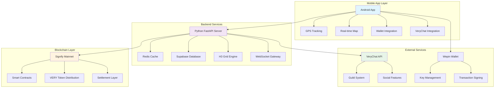

# StrideOn — The City Is Your Arena

<div align="center">


**A revolutionary blockchain-based Move-to-Earn game that transforms your city into a competitive arena**

*Turn outdoor activity into strategic territory battles while earning VERY tokens*

🎥 **[Demo Video](#-demo-video)** | 📱 **[Try the App](#-getting-started)** | 🌐 **[Landing Page](#-landing-page)** | 📚 **[Documentation](https://www.notion.so/Complete-Technical-Architecture-Data-Flow-25eda6675e0c80228517e6003ed156c7)**

</div>

---

## 🌟 What is StrideOn?

StrideOn is a **decentralized, move-to-earn game** where your physical movement becomes strategic gameplay. Built on **Signify Mainnet** with **Very Network** integration, it combines paper.io mechanics with real-world activity, turning your city into a competitive arena.

### 🎯 Core Concept
- **Trail & Claim**: Create live trails as you move, close loops to claim territory on an H3 hex grid
- **Tactical Risk**: Your active trail is vulnerable—rivals can cut it by crossing your path
- **Territory Control**: Expand, defend, and outmaneuver nearby runners in real-time
- **Earn VERY**: Get rewarded with VERY tokens for successful territory claims

---

## 🏗️ Architecture Overview

<div align="center">



</div>

### Speed-First Design Philosophy
- **Off-chain Game Loop**: Sub-150ms response time for real-time gameplay
- **On-chain Settlement**: Trustless verification and reward distribution
- **Redis-First**: Hot game state in memory, Postgres for finalized results only
- **Regional Sharding**: Spatial optimization using H3 grid clustering

---

## 🎮 Core Features

### 🏃‍♂️ Real-Time Territory Control
- **Live Trail Drawing**: GPS coordinates mapped to H3 hexagonal grid
- **Loop Closure Detection**: Advanced polygon detection when you return to owned territory  
- **Cut Mechanics**: Strategic interception of rival trails for bonus points
- **Area Calculation**: Precise territory measurement using flood-fill algorithms

### ⚡ Power-ups System
| Power-up | Effect | Duration | Strategy |
|----------|--------|----------|----------|
| 🛡️ **Shield** | Trail immunity from cuts | 60 seconds | Protect risky expansions |
| 👻 **Ghost Mode** | Invisible to other players | 45 seconds | Stealth attacks |
| 🚀 **Speed Boost** | 2x claim rate multiplier | 90 seconds | Maximize area capture |

### 🏆 Competitive Elements
- **Daily Leaderboards**: City-wide rankings with VERY token prizes
- **Presence System**: See nearby runners in real-time
- **Guild Integration**: Team up via VeryChat for coordinated strategies
- **Achievement System**: Unlock badges and special rewards

### 💰 Token Economics
- **VERY Token Rewards**: Earn tokens based on territory claimed and held
- **Staking Mechanics**: Lock tokens for enhanced earning multipliers
- **Power-up Marketplace**: Spend tokens for strategic advantages
- **Daily Settlement**: Automated reward distribution to top performers

---

## 🔗 Blockchain Integration

### Signify Mainnet Deployment
- **Network**: Signify Mainnet (Production-ready blockchain)
- **Smart Contracts**: Deployed and verified settlement contracts
- **Gas Efficiency**: Optimized for low-cost transactions
- **Security**: Multi-signature validation for large reward distributions

### Very Network Features
- **Token Standard**: Native VERY token integration
- **Cross-chain Bridge**: Seamless token movement between networks
- **DeFi Integration**: Liquidity pools and yield farming opportunities
- **Governance**: Token holder voting on game parameters

### Contract Architecture
```solidity
// Core game settlement contract
contract StrideOnSettlement {
    mapping(address => uint256) public playerScores;
    mapping(bytes32 => bool) public processedBatches;
    
    function settleDailyRewards(bytes32 merkleRoot, bytes32[] calldata proofs) external;
    function claimRewards(uint256 amount, bytes32[] calldata proof) external;
}
```

---

## 🗣️ VeryChat Integration

### Social Gaming Features
- **Guild Formation**: Create and join running crews
- **Strategy Coordination**: Plan territory expansions with teammates  
- **Live Commentary**: Real-time chat during gameplay sessions
- **Achievement Sharing**: Broadcast your victories to the community

### Communication Channels
- **City Channels**: Location-based chat rooms
- **Guild Private Chat**: Secure team communication
- **Global Announcements**: Major game events and updates
- **Direct Messaging**: One-on-one strategy discussions

---

## 📱 Technical Implementation

### Android App Features
- **Kotlin Native**: Optimized performance for real-time gaming
- **Google Maps Integration**: Accurate GPS tracking and visualization
- **Foreground Service**: Continuous location tracking during gameplay
- **Offline Queue**: Handle intermittent connectivity gracefully
- **Anti-cheat**: Motion sensors and root detection

### Backend Architecture
- **Python FastAPI**: High-performance async API server
- **Redis Pub/Sub**: Real-time event broadcasting to nearby players
- **Supabase Integration**: Postgres database with real-time subscriptions
- **H3 Spatial Indexing**: Efficient hex grid operations and queries
- **WebSocket Gateway**: Low-latency bidirectional communication

### Database Design
```sql
-- Core game entities
profiles (user_id, username, wepin_address, city, created_at)
sessions (id, user_id, started_at, ended_at, status)
claims (id, user_id, area_m2, h3_cells[], created_at)
leaderboard_daily (day, city, user_id, score, rank)
powerup_uses (id, user_id, powerup_type, activated_at, session_id)
```

---

## 🚀 Getting Started

### Prerequisites
- Android 10+ device with GPS
- Wepin wallet (created automatically)
- Location permissions enabled

### Quick Start Guide
1. **Download**: Get StrideOn from the app store
2. **Sign Up**: Create account with email/phone/social login
3. **Wallet Setup**: Automatic Wepin wallet creation and linking
4. **Start Moving**: Begin your first trail in your neighborhood
5. **Claim Territory**: Close loops to claim hexagonal areas
6. **Earn Rewards**: Accumulate VERY tokens based on performance

### Developer Setup
```bash
# Clone repository
git clone https://github.com/yourusername/strideon
cd strideon

# Backend setup
python -m venv .venv
source .venv/bin/activate
pip install -r requirements.txt

# Environment configuration
cp .env.example .env
# Edit .env with your Supabase and blockchain credentials

# Run backend server
uvicorn app:app --reload

# Android development
cd android
./gradlew assembleDebug
```

---

## 🎯 Game Mechanics Deep Dive

### H3 Grid System
- **Resolution Level**: City-scale granularity (H3 resolution 9-10)
- **Hex Advantages**: Equal-area cells, neighbor consistency, spatial optimization
- **Trail Snapping**: GPS coordinates mapped to hex centers for accuracy
- **Boundary Detection**: Efficient polygon operations on hex grids

### Real-Time Collision Detection
```python
def check_trail_intersection(trail_a: List[H3Cell], trail_b: List[H3Cell]) -> bool:
    """Detect if two trails intersect using spatial indexing"""
    for segment_a in get_segments(trail_a):
        for segment_b in get_segments(trail_b):
            if segments_intersect(segment_a, segment_b):
                return True
    return False
```

### Anti-Cheat Measures
- **Velocity Bounds**: Maximum speed thresholds based on activity type
- **GPS Drift Filtering**: Kalman filter for location smoothing
- **Device Fingerprinting**: Hardware-based player identification
- **Behavioral Analysis**: Pattern detection for impossible movements

---

## 🔮 Future Roadmap

### Phase 1: MVP (Complete)
- ✅ Android app with basic trail mechanics
- ✅ Real-time multiplayer presence
- ✅ Territory claiming and visualization
- ✅ Signify Mainnet integration
- ✅ VeryChat social features

### Phase 2: Enhanced Gameplay (Q1 2025)
- 🔄 Advanced power-up system
- 🔄 Guild wars and team competitions
- 🔄 Cross-city tournaments
- 🔄 NFT achievement badges
- 🔄 Augmented reality trail visualization

### Phase 3: Ecosystem Expansion (Q2 2025)
- ⏳ Multi-city deployment (10+ major cities)
- ⏳ iOS app release
- ⏳ Fitness tracker integrations (Apple Health, Google Fit)
- ⏳ Corporate wellness partnerships
- ⏳ Advanced analytics dashboard

### Phase 4: Platform Evolution (Q3 2025)
- ⏳ Custom map creation tools
- ⏳ Developer SDK for third-party games
- ⏳ Cross-game token utility
- ⏳ Decentralized governance implementation
- ⏳ Layer 2 scaling solutions

---

## 📊 Performance Metrics

### Technical KPIs
- **Response Time**: <150ms average API response
- **Concurrent Users**: Support for 1000+ simultaneous players per city
- **GPS Accuracy**: ±5 meter precision in urban environments
- **Uptime**: 99.9% service availability target
- **Battery Optimization**: <5% additional drain during active play

### Game Economy
- **Daily Active Users**: Growing player base engagement
- **Token Distribution**: Fair reward allocation across skill levels  
- **Territory Turnover**: Healthy competitive balance
- **Power-up Usage**: Strategic item consumption patterns
- **Guild Participation**: Social feature adoption rates

---

## 🎥 Demo Video

*[Video placeholder - Upload your demo video showing the gameplay loop]*

**What you'll see:**
- Real-time trail drawing on city map
- Territory claiming mechanics in action
- Player interactions and competitive gameplay
- VERY token earning and reward system
- VeryChat integration during live play

---

## 🌐 Landing Page

*[Landing page placeholder - Link to your marketing website]*

Visit our landing page for:
- Game overview and screenshots
- Download links for different platforms
- Community leaderboards and statistics  
- News and development updates
- Partnership announcements

---

## 📚 Documentation & Resources

### Technical Documentation
- 📋 **[Complete Architecture Guide](https://www.notion.so/Complete-Technical-Architecture-Data-Flow-25eda6675e0c80228517e6003ed156c7)** - Detailed system design
- 🎨 **[Figma Architecture Board](https://www.figma.com/board/TDvmb7NZhGjIIskTa9DAgy/StrideOn)** - Visual system overview
- 🔗 **[API Documentation](#)** - Backend endpoint reference
- 📱 **[Mobile Integration Guide](#)** - Android development setup

### Smart Contract Documentation
- 📄 **[Contract ABIs](./contracts/abis/)** - Interface definitions
- 🔐 **[Security Audits](#)** - Third-party security reviews
- 💰 **[Tokenomics Paper](#)** - Economic model details
- 🏛️ **[Governance Docs](#)** - DAO implementation plan

### Community Resources
- 💬 **[Discord Server](#)** - Developer and player community
- 📱 **[VeryChat Channels](#)** - In-game social integration
- 📺 **[YouTube Channel](#)** - Tutorials and gameplay videos
- 📝 **[Medium Blog](#)** - Development updates and insights

---

## 🤝 Contributing

We welcome contributions from developers, designers, and the gaming community!

### Development Contributions
- 🐛 **Bug Reports**: Use GitHub issues for bug tracking
- 💡 **Feature Requests**: Propose new gameplay mechanics
- 🔧 **Pull Requests**: Follow our coding standards and testing requirements
- 📖 **Documentation**: Help improve guides and tutorials

### Community Contributions
- 🎮 **Beta Testing**: Join early access programs
- 🎨 **Asset Creation**: Design power-up icons and UI elements
- 🗺️ **City Mapping**: Help optimize H3 grids for new locations
- 📢 **Community Building**: Organize local gaming meetups

---

## 📄 License & Legal

This project is licensed under the MIT License - see the [LICENSE](LICENSE) file for details.

### Third-party Acknowledgments
- **Signify Mainnet** - Blockchain infrastructure provider
- **Very Network** - Token economics and DeFi integration
- **VeryChat** - Social features and communication layer
- **Wepin** - Secure wallet infrastructure
- **Supabase** - Database and real-time features
- **H3 by Uber** - Spatial indexing system

### Privacy & Data Protection
- Minimal location data retention policy
- GDPR compliance for European users
- Opt-in anonymized analytics
- Secure wallet key management through Wepin

---

## 📞 Support & Contact

### Technical Support
- 📧 **Email**: support@strideon.game
- 💬 **VeryChat**: @StrideOnSupport
- 📱 **In-App**: Help center and chat support
- 🐛 **Bug Reports**: GitHub issues tracker

### Business Inquiries
- 🤝 **Partnerships**: partnerships@strideon.game  
- 🏢 **Enterprise**: enterprise@strideon.game
- 📺 **Media**: media@strideon.game
- 💰 **Investment**: investors@strideon.game

---

<div align="center">

**🏃‍♂️ Ready to turn your city into your playground? 🚀**

*Join thousands of players earning VERY tokens while staying active!*


---

*Built with ❤️ by the StrideOn team for the global fitness gaming community*

</div>
