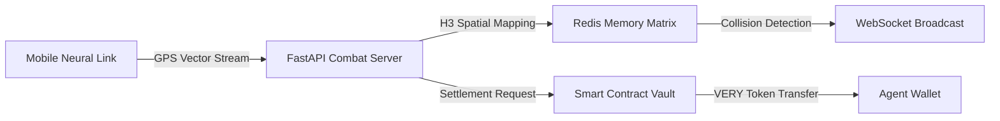

```
╔══════════════════════════════════════════════════════════════════════════════╗
║                          ▓▓▓▓▓▓▓▓▓▓▓▓▓▓▓▓▓▓▓▓▓▓▓▓                            ║
║                          ▓ NEURAL GRID ACTIVE ▓                             ║
║                          ▓▓▓▓▓▓▓▓▓▓▓▓▓▓▓▓▓▓▓▓▓▓▓▓                            ║
╚══════════════════════════════════════════════════════════════════════════════╝
```

<div align="center">


# ⚡ S T R I D E O N ⚡
## 『 THE CITY IS YOUR BATTLEGROUND 』

[](https://very.network)
[](https://strideon.vercel.app/)
[](https://h3geo.org/)
[](https://strideon.vercel.app/)

```
┌─────────────────────────────────────────────────────────────────┐
│  TRANSFORM YOUR URBAN ENVIRONMENT INTO A STRATEGIC WARZONE      │
│  > Kinetic Movement Protocol ........................ [ACTIVE]  │
│  > Territorial Acquisition System ................... [ONLINE]  │
│  > Blockchain Settlement Layer ...................... [SYNCED]  │
└─────────────────────────────────────────────────────────────────┘
```

### ⟨ CYBERSPACE MEETS MEATSPACE ⟩
*Convert physical locomotion into competitive territorial warfare while harvesting VERY tokens*

```
[SYSTEM ACCESS POINTS]
```
📱 **[ANDROID NEURAL LINK](https://github.com/chandan989/StrideOn/tree/main/StrideonApp)** • 🍎 **[iOS NEURAL LINK](https://github.com/chandan989/StrideOn/tree/main/StrideonApp-iOS)** • 🎥 **[MISSION BRIEFING](https://www.youtube.com/watch?v=z3qVbHfGXVc)** • 🌐 **[COMMAND CENTER](https://strideon.vercel.app/)** • 📚 **[TECH SPECS](https://www.notion.so/Complete-Technical-Architecture-Data-Flow-25eda6675e0c80228517e6003ed156c7)**

</div>


```
═══════════════════════════════════════════════════════════════════════════════
                            [INITIALIZATION SEQUENCE]
═══════════════════════════════════════════════════════════════════════════════
```

## 🎯 THE PROTOCOL VISION

**StrideOn** is a next-generation kinetic warfare protocol that bridges the gap between legacy fitness applications and complex Web3 combat systems. We've engineered a competitive move-to-earn battleground that's genuinely immersive, hyper-social, and serves as a neural gateway to the decentralized future.

> **⚠️ SYSTEM ANALYSIS**:  
> **[THREAT]** Legacy fitness apps: Low retention rates. Web3 games: Disconnected from physical reality.  
> **[SOLUTION]** GPS-based territorial warfare protocol that transforms every urban corridor into a tactical opportunity.

```
═══════════════════════════════════════════════════════════════════════════════
                            [PROTOCOL MECHANICS]
═══════════════════════════════════════════════════════════════════════════════
```

## 💡 OPERATIONAL FRAMEWORK

StrideOn deploys cutting-edge **H3 hexagonal spatial indexing** to transform urban environments into competitive combat zones with precision territorial control.

### 🎮 CORE COMBAT LOOP

```
┌──────────────────────────────────────────────────────────────┐
│                                                              │
│  🏃‍♂️ INITIATE → ⚔️ ENGAGE → 🏦 SECURE → 💰 EXTRACT          │
│                                                              │
│  [PHASE 1] Trail Generation Protocol                        │
│  [PHASE 2] Territorial Engagement System                    │
│  [PHASE 3] Blockchain Settlement Sequence                   │
│  [PHASE 4] Token Extraction & Dominance Metrics             │
│                                                              │
└──────────────────────────────────────────────────────────────┘
```

**[PHASE 1] TRAIL GENERATION**  
Deploy kinetic energy to generate luminescent GPS pathways mapped to H3 hex cells. Every movement vector becomes part of your digital territorial claim.

**[PHASE 2] TERRITORIAL ENGAGEMENT**  
Detect hostile agent trails in real-time. Execute **trail severance protocols** to intercept enemy progress—or deploy strategic loop formations to claim enclosed hexagonal sectors.

**[PHASE 3] BLOCKCHAIN SETTLEMENT**  
Navigate to designated banking nodes (real-world landmarks) to initiate settlement sequences. Convert claimed territory into permanent **VERY tokens** via on-chain verification.

**[PHASE 4] TOKEN EXTRACTION**  
Secure earnings on distributed ledger, compete on global dominance rankings, and establish territorial supremacy.


```
═══════════════════════════════════════════════════════════════════════════════
                        [VISUAL RECONNAISSANCE FEED]
═══════════════════════════════════════════════════════════════════════════════
```

## 📸 SURVEILLANCE INTERFACE

<div align="center">

| Welcome | Login | Registration |
|:-------:|:-----:|:------------:|
|  |  |  |

| Home Dashboard | Live H3 Map | Power-ups |
|:--------------:|:-----------:|:---------:|
|  |  |  |

| Power-up Details | System Architecture |
|:----------------:|:-------------------:|
|  |  |

</div>

```
═══════════════════════════════════════════════════════════════════════════════
                        [NETWORK INTEGRATION PROTOCOL]
═══════════════════════════════════════════════════════════════════════════════
```

## ⚡ VERY NETWORK INTEGRATION

StrideOn isn't just deployed *on* Very Network—it's architected to demonstrate its capabilities through deep protocol integration.

### 🏃‍♂️ Real-World Utility Matrix
Transform kinetic energy expenditure into quantifiable value. Unlike abstract DeFi constructs or purely virtual NFT ecosystems, StrideOn generates tangible utility from physical movement vectors.

### 💬 VeryChat Neural Link
Real-time social intelligence transmitted directly to **VeryChat** communication channels:
- **Threat Alerts**: Instant notifications when hostile agents sever your trail
- **Squad Formation**: Coordinate with local operatives for neighborhood domination
- **Social Warfare**: Build alliances through competitive engagement protocols

### 💰 VERY TOKEN ECONOMY

The **VERY token** powers all economic transactions:
- **Rewards Protocol**: Extract tokens for territorial acquisitions and dominance rankings
- **Enhancement Systems**: Deploy tokens for tactical advantages (Shield, Ghost Mode, Velocity Boost)
- **Staking Mechanisms**: Lock tokens for amplified earning multipliers
- **Governance Matrix**: Vote on protocol upgrades, territorial expansions, and system parameters

```
═══════════════════════════════════════════════════════════════════════════════
                        [TECHNICAL INFRASTRUCTURE]
═══════════════════════════════════════════════════════════════════════════════
```

## 🏗️ SYSTEM ARCHITECTURE

<div align="center">

[](https://www.figma.com/board/TDvmb7NZhGjIIskTa9DAgy/StrideOn?node-id=0-1&t=XZz5CEsqnGmjazmq-1)


</div>

### HYBRID ARCHITECTURE: VELOCITY + SECURITY

**⚡ OFF-CHAIN COMBAT LAYER** (Velocity-Optimized)
- **FastAPI Neural Core**: Sub-150ms response latency for real-time GPS vector processing
- **Redis Memory Matrix**: In-memory hot state cache for instantaneous responses
- **WebSocket Neural Gateway**: Live multiplayer synchronization protocols
- **H3 Spatial Engine**: Uber's hexagonal grid system for precision territorial mapping

**🔒 ON-CHAIN SETTLEMENT LAYER** (Security-Hardened)
- **Signify Mainnet**: High-throughput blockchain optimized for combat operations
- **Smart Contract Vault**: Secure banking and transparent reward distribution protocols
- **Merkle Proof Verification**: Gas-efficient batch validation systems
- **VERY Token**: Native currency for all economic operations

### DATA FLOW ARCHITECTURE



---

## 🎮 Game Mechanics

### H3 Hexagonal Grid System

StrideOn uses **Uber's H3** for fair, efficient spatial gaming:
- **Resolution 9-10**: ~150-300m diameter cells, perfect for city-scale gameplay
- **Equal-Area**: Every hex covers the same ground area globally
- **Efficient Neighbors**: Fast proximity calculations for player detection
- **Global Consistency**: Same hex ID = same location worldwide

### Strategic Power-ups

| Power-up | Effect | Duration | Cost | Use Case |
|----------|--------|----------|------|----------|
| 🛡️ **Shield** | Trail immunity | 60s | 50 VERY | Protect risky expansions |
| 👻 **Ghost Mode** | Invisibility | 45s | 75 VERY | Stealth attacks |
| 🚀 **Speed Boost** | 2x claim rate | 90s | 100 VERY | Maximize captures |
| ❄️ **Freeze** | Stop rivals | 30s | 150 VERY | Defensive measure |
| 🔥 **Territory Burn** | Destroy claims | Instant | 200 VERY | Aggressive counter |

### Real-time Features
- **Live Player Tracking**: See active competitors nearby
- **Proximity Alerts**: Notifications when rivals approach
- **Cut Notifications**: Instant alerts via app + VeryChat
- **Territory Visualization**: Live map of claims and trails
- **Leaderboards**: Daily VERY token prizes for top performers

---

## 📱 MOBILE NEURAL INTERFACES

### ANDROID COMBAT TERMINAL

Built with modern **Kotlin** architecture for optimal combat performance.

**Tech Stack**
- **Kotlin + Jetpack Compose**: Reactive UI with efficient state management
- **Google Maps SDK**: High-precision mapping with H3 overlays
- **Foreground Service**: Reliable background GPS tracking
- **WebSocket Client**: Real-time server communication
- **Room Database**: Local caching for offline capabilities

**Key Implementation**

```kotlin
class TrailManager {
    fun startTrailRecording(sessionId: String) {
        locationProvider.locationUpdates
            .map { location -> h3Service.latLngToCell(location.lat, location.lng) }
            .distinctUntilChanged()
            .collect { h3Cell ->
                updateActiveTrail(sessionId, h3Cell)
                checkForLoopClosure(h3Cell)
                broadcastPositionUpdate(h3Cell)
            }
    }
}
```

**Deployment Protocol**

```bash
# Prerequisites: Android Studio Hedgehog+, Android 10+ with GPS
git clone [repo] && cd strideon-android
./gradlew assembleDebug

# Grant location permissions and configure API endpoints in local.properties
```

---

### iOS COMBAT TERMINAL

Built with **Swift** and **SwiftUI** for seamless Apple ecosystem integration.

**Tech Stack**
- **Swift + SwiftUI**: Native reactive UI framework
- **MapKit + H3-Swift**: High-precision mapping with hexagonal overlays
- **Background Location**: Continuous GPS tracking with Core Location
- **Combine Framework**: Reactive data streams and WebSocket integration
- **Core Data**: Local persistence and offline capabilities

**Key Implementation**

```swift
class TrailManager: ObservableObject {
    func startTrailRecording(sessionId: String) {
        locationProvider.locationUpdates
            .map { location in h3Service.latLngToCell(lat: location.latitude, lng: location.longitude) }
            .removeDuplicates()
            .sink { h3Cell in
                self.updateActiveTrail(sessionId: sessionId, cell: h3Cell)
                self.checkForLoopClosure(cell: h3Cell)
                self.broadcastPositionUpdate(cell: h3Cell)
            }
            .store(in: &cancellables)
    }
}
```

**Deployment Protocol**

```bash
# Prerequisites: Xcode 15+, iOS 16+ device with GPS
git clone [repo] && cd strideon-ios
open StrideOn.xcodeproj

# Configure signing, enable location capabilities, and add API endpoints to Config.plist
# Build and run on device (Simulator has limited GPS capabilities)
```

---

## 🐍 Python Backend

High-performance **FastAPI** server handling real-time game logic.

### Core Components
- **FastAPI + Uvicorn**: Async framework for high concurrency
- **WebSocket Manager**: Real-time bidirectional communication
- **Redis**: In-memory game state and pub/sub messaging
- **Supabase**: Persistent database operations
- **H3 Library**: Spatial calculations

### Real-time Game Loop

```python
class GameServer:
    async def handle_gps_update(self, user_id: str, lat: float, lng: float):
        h3_cell = h3.latlng_to_cell(lat, lng, resolution=9)
        await self.redis.lpush(f"trail:{user_id}:active", h3_cell)
        
        nearby_players = await self.get_nearby_players(h3_cell, radius=5)
        for player in nearby_players:
            if await self.check_trail_intersection(user_id, player.id):
                await self.process_cut_event(user_id, player.id)
        
        await self.websocket_manager.broadcast_to_region(
            h3_cell, {"type": "position_update", "user": user_id, "cell": h3_cell}
        )
```

### Setup

```bash
python -m venv .venv && source .venv/bin/activate
pip install fastapi uvicorn supabase redis h3 python-dotenv
uvicorn app:app --reload --host 0.0.0.0 --port 8000
```

### API Endpoints
- `POST /sessions/start` - Begin game session
- `WebSocket /ws/{user_id}/{city}` - Real-time communication
- `POST /territory/claim` - Process territory claims
- `GET /leaderboard/{city}` - City rankings
- `POST /powerups/activate` - Use power-ups

---

## 🔗 Blockchain Integration

### Smart Contracts

**VERY Token Contract**
- ERC-20 compatible with gaming extensions
- Daily mint limits for inflation control
- Staking mechanisms for enhanced rewards
- Governance voting capabilities

**Game Settlement Contract**

```solidity
contract StrideOnSettlement {
    mapping(address => uint256) public playerScores;
    
    function settleDailyRewards(
        bytes32 merkleRoot,
        address[] calldata winners,
        uint256[] calldata amounts,
        bytes32[][] calldata proofs
    ) external onlyValidator {
        // Verify Merkle proofs and distribute VERY tokens
    }
    
    function claimBankedTerritory(
        uint256 area,
        bytes32[] calldata proof
    ) external {
        // Verify claim and mint VERY tokens
    }
}
```

### Wepin Wallet Integration
- **Automatic Creation**: Transparent wallet creation for new players
- **Social Recovery**: Account recovery via social verification
- **Hardware Security**: Private keys in secure enclaves
- **Multi-chain Support**: Ready for cross-chain expansion

---

## 🌍 Multi-City Expansion

Designed for global scalability from day one.

### City Configuration

```python
@dataclass
class CityConfig:
    name: str
    timezone: str
    center_coordinates: Tuple[float, float]
    h3_resolution: int
    daily_reward_pool: int
    special_events: List[str]
    power_up_costs: Dict[str, int]

SUPPORTED_CITIES = {
    "chandigarh": CityConfig(
        name="Chandigarh",
        timezone="Asia/Kolkata",
        center_coordinates=(30.7333, 76.7794),
        h3_resolution=9,
        daily_reward_pool=50000,  # 50K VERY daily
        special_events=["monsoon_marathon", "diwali_dash"],
        power_up_costs={"shield": 50, "ghost": 75, "speed": 100}
    )
}
```

### Regional Optimization
- **Server Sharding**: Dedicated servers per region
- **Cultural Adaptation**: City-specific events
- **Economic Balancing**: Rewards adjusted for player density
- **Language Support**: Localized UI

---

## 🚀 Getting Started

### For Agents
1. **Download** from Google Play Store or Apple App Store
2. **Sign Up** with email/phone/social authentication
3. **Complete Tutorial** (5-minute tactical briefing)
4. **Start Moving** and initiate territorial claims
5. **Earn VERY Tokens** by executing banking protocols

### For Developers

#### Backend Deployment
```bash
git clone https://github.com/strideon/strideon-game
cd strideon-game
python -m venv .venv && source .venv/bin/activate
pip install -r requirements.txt
redis-server
uvicorn app:app --reload
```

#### Android Terminal Setup
```bash
cd strideon-android
./gradlew assembleDebug
```

#### iOS Terminal Setup
```bash
cd strideon-ios
open StrideOn.xcodeproj
# Build and run on physical device
```

#### Environment Variables
```env
SUPABASE_URL=https://your-project.supabase.co
SUPABASE_ANON_KEY=your-key
REDIS_URL=redis://localhost:6379/0
SIGNIFY_RPC_URL=https://rpc.signify.network
VERY_TOKEN_CONTRACT=0x...
WEPIN_APP_ID=your-app-id
```

---

## 🔮 Roadmap

| Phase | Timeline | Milestones |
|-------|----------|------------|
| **Beta Launch** | Q4 2024 | 1000+ agents in Chandigarh, core combat mechanics operational |
| **Multi-City** | Q1 2025 | 5 Indian cities, squad system, VeryChat neural integration |
| **Global Scaling** | Q2 2025 | 25+ cities worldwide, fitness tracker integration, wearable support |
| **Platform Evolution** | Q3 2025 | DAO governance, NFT achievement system, developer SDK |
| **Ecosystem Maturity** | Q4 2025 | Cross-platform sync, esports tournaments, charity partnerships |

**Current Status**: Android & iOS neural terminals fully operational

---

## 📊 Technical Specs

### Performance
- **Response Time**: <150ms for real-time operations
- **Concurrent Users**: 5000+ per city region
- **GPS Accuracy**: ±5 meters in urban areas
- **Battery Drain**: <8% during active gameplay
- **Network Usage**: <50MB/hour

### Security
- **Anti-cheat**: Velocity bounds, GPS consistency, behavioral analysis
- **Privacy**: Minimal location retention, user-controlled settings
- **Transactions**: Cryptographic signatures and verification
- **Encryption**: End-to-end for sensitive communications


```
═══════════════════════════════════════════════════════════════════════════════
                        [ALLIANCE PROTOCOLS]
═══════════════════════════════════════════════════════════════════════════════
```

## 🤝 COALITION NETWORK

### Built for DoraHacks
StrideOn represents the evolution of Web3 combat systems—blockchain technology augmenting physical reality, making decentralized protocols accessible through the universal act of kinetic movement.

### OPERATIVE CHANNELS
- **GitHub**: [Open-source development nexus](https://github.com/strideon)
- **Discord**: Tactical communications hub
- **VeryChat**: Agent community and squad coordination
- **Twitter**: Protocol updates and combat intelligence

### DEVELOPER ARMORY
- [API Documentation](https://docs.strideon.app)
- [Mobile SDKs](https://github.com/strideon/sdk)
- [Smart Contract Interfaces](https://github.com/strideon/contracts)
- [Testing Frameworks](https://github.com/strideon/testing)

```
═══════════════════════════════════════════════════════════════════════════════
                        [LICENSE & TECHNOLOGY STACK]
═══════════════════════════════════════════════════════════════════════════════
```

## 📄 SYSTEM COMPONENTS

### Core Technologies
- **Very Network** → Blockchain infrastructure layer
- **VeryChat** → Social warfare protocols
- **Signify Mainnet** → Production blockchain deployment
- **Supabase** → Backend neural network
- **H3 by Uber** → Spatial indexing matrix
- **Wepin** → Wallet security vault

### Contributing to the Protocol
We welcome tactical contributions:
- 🐛 **Bug Reports** → System vulnerability identification
- 💡 **Feature Requests** → Combat enhancement proposals
- 🔧 **Code Contributions** → Protocol improvements
- 📖 **Documentation** → Knowledge base expansion
- 🎉 **Community Events** → Territorial warfare tournaments

**License**: MIT Protocol

```
═══════════════════════════════════════════════════════════════════════════════
                        [DEPLOYMENT INITIALIZATION]
═══════════════════════════════════════════════════════════════════════════════
```

<div align="center">

### ⚡ READY TO TRANSFORM YOUR URBAN ENVIRONMENT INTO A COMBAT ZONE? ⚡

```
┌─────────────────────────────────────────────────────────────────┐
│                                                                 │
│  JOIN THE KINETIC WARFARE REVOLUTION                            │
│  > Making fitness protocols engaging                            │
│  > Making Web3 accessible to all agents                         │
│                                                                 │
└─────────────────────────────────────────────────────────────────┘
```

**[⚡ DEPLOY NOW](#-getting-started)** • **[📡 WATCH BRIEFING](https://www.youtube.com/watch?v=z3qVbHfGXVc)** • **[🌐 ACCESS HQ](https://strideon.vercel.app/)**

---

```
> SYSTEM STATUS ........................... [OPERATIONAL]
> PROTOCOL VERSION ........................ [v1.0.0]
> NETWORK UPTIME ........................... [99.9%]
```

*Engineered with ⚡ for the global kinetic warfare community*

[](https://very.network)

```
╔══════════════════════════════════════════════════════════════════════════════╗
║                    END OF TRANSMISSION - STAY VIGILANT                       ║
╚══════════════════════════════════════════════════════════════════════════════╝
```

</div>
